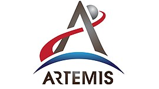

# Artemis Project Analysis

**Project description:**\
Prediction of weight, type of future sampling, etc. from existing data of Apollo space program.

---

**Resources:**
- Project source: [Plan moon mission using Python](https://learn.microsoft.com/en-us/training/modules/plan-moon-mission-using-python-pandas/) _(with more details)_.
- Apollo history in [Wikipedia](https://fa.wikipedia.org/wiki/%D8%A8%D8%B1%D9%86%D8%A7%D9%85%D9%87_%D9%81%D8%B6%D8%A7%DB%8C%DB%8C_%D8%A2%D9%BE%D9%88%D9%84%D9%88).
- The raw data is scraped from [here](https://curator.jsc.nasa.gov/lunar/samplecatalog/sample_results_list.cfm) into CSV file in Data folder.

